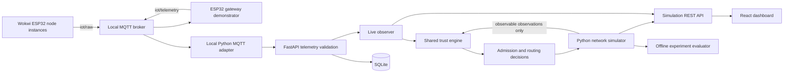

# Architecture

## Two demonstration layers

The live gateway and software network simulator are distinct data sources. The
hardware demonstrator is a broker-mediated star and does not emulate real ESP-NOW
or a multi-hop radio mesh. The Python layer executes the research-scale topology,
per-hop packet attempts, delays, retries, route changes and recovery.

## Modules and trust boundary

`World` generates sensor readings, environmental truth and fault behavior. Only
`Observation(node_id, temperature, humidity, delivered, latency_ms, sensor_ok)`
records cross into `TrustEngine`. The controller also knows the declared physical
neighborhood, which is a deployment input. It does not know which scenario is
active, the fault interval, the corrupted-node set or true temperature.

`Simulation` owns the evaluator and can compare decisions against truth. Its
metrics are therefore evaluation output, never trust-engine inputs. Manual fault
commands are operator controls over the simulated world; they are not observation
labels delivered to the algorithm. The live API rejects extra fault-label fields.

## Two different decisions

- Sensing trust controls whether a node's measurements are admitted as application
  data. Quarantined/recovering sensing nodes are still monitored.
- Communication trust controls relay eligibility and the route cost. A sensor fault
  alone leaves a healthy relay available. Isolated/recovering relays cannot carry
  other nodes' traffic.

The displayed overall state is the most restrictive of the two dimensions. This
is a display summary, not a substitute for the two separate control decisions.

## Network execution

The graph is a spatial grid, with a gateway to its left. Default communication and
sensing radii are each 1.5 distance units, stored separately. Links have a 5 ms
half-duplex service occupancy, stochastic success and transit delay. One retry is
allowed per hop. Arrival events are placed in a priority queue and are delivered
only when simulated time reaches them. Packets still in flight at the experiment
end are counted and not invented as delivered.

A reverse Dijkstra tree computes all routes in one pass. Tests compare its path
costs with a separate source-by-source reference implementation. The routing
controller is centralized; controller outages and control-message delay/loss are
not modeled. Route updates are applied immediately and their estimated packet
cost is counted.

A separate diagnostic management channel probes every node once per sampling
interval, including isolated nodes. It carries readings and on-time/late delivery
evidence to the observer. It uses the same node-fault model but bypasses the mesh.
Probe requests/replies are counted. This is an explicit favorable assumption,
not a free or physically verified recovery channel.

## Backend and UI

FastAPI validates telemetry; SQLite stores registrations, immutable telemetry
records and completed interactive run summaries. `(node_id, boot_id, sequence)`
is the unique telemetry key. The live observer rejects retired boot sessions
within a running process and duplicate/out-of-order sequences. Trust state resets
on server restart; persistent data remains available in SQLite.

Simulation snapshots expose topology, routes, trust histories, classifications,
metrics and event timelines. The dashboard polls local APIs. It contains overview,
live-gateway, experiments and methodology views. No external fonts or analytics
are used. Bind the backend to loopback: it has no multi-user authentication layer.
