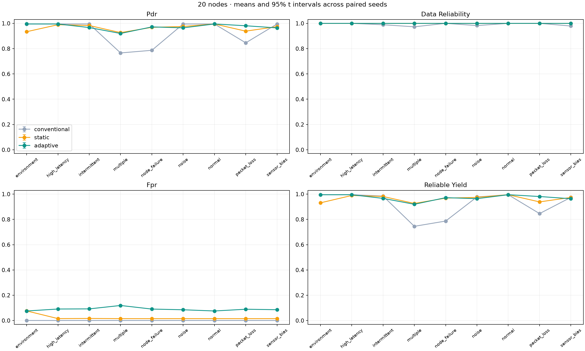
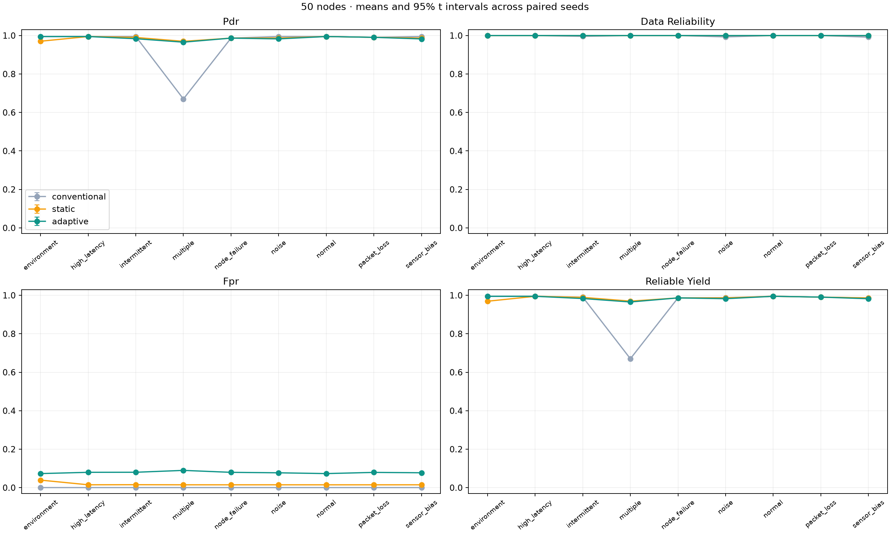
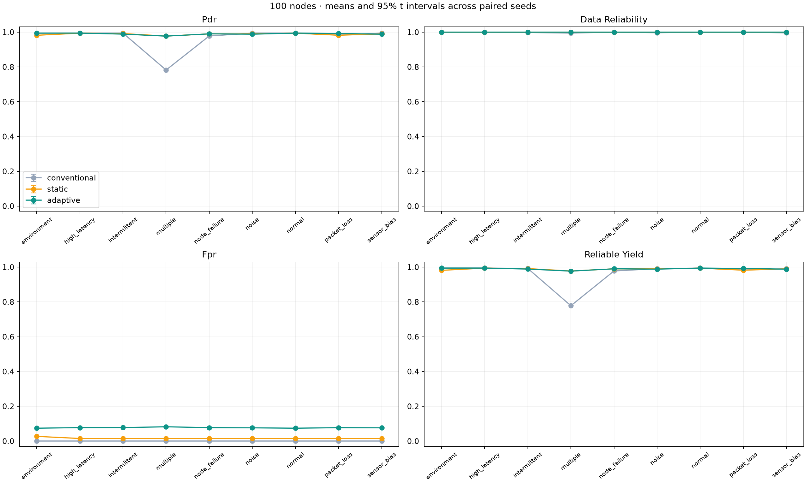

# Measured simulation results

These results come from 2,430 executed simulations, with 30 paired seeds per configuration. They describe this synthetic model only. No physical/Wokwi runtime result is implied.

## Twenty-node comparison

Percentages are means across runs. SDs, sample counts and 95% intervals are in the full aggregate files.

| Scenario | Method | PDR | Accepted-data reliability | Reliable yield | False-positive state occupancy |
| --- | --- | ---: | ---: | ---: | ---: |
| environment | adaptive | 99.51% | 100.00% | 99.51% | 7.57% |
| environment | conventional | 99.51% | 100.00% | 99.51% | 0.00% |
| environment | static | 93.40% | 100.00% | 93.10% | 7.61% |
| high_latency | adaptive | 99.51% | 100.00% | 99.51% | 9.12% |
| high_latency | conventional | 99.51% | 100.00% | 99.51% | 0.00% |
| high_latency | static | 98.93% | 100.00% | 98.93% | 1.54% |
| intermittent | adaptive | 96.67% | 99.98% | 96.62% | 9.23% |
| intermittent | conventional | 99.51% | 98.91% | 98.43% | 0.00% |
| intermittent | static | 98.30% | 100.00% | 98.12% | 1.64% |
| multiple | adaptive | 92.00% | 99.98% | 91.96% | 11.92% |
| multiple | conventional | 76.61% | 97.28% | 74.53% | 0.00% |
| multiple | static | 92.66% | 100.00% | 92.60% | 1.52% |
| node_failure | adaptive | 97.19% | 100.00% | 97.19% | 9.08% |
| node_failure | conventional | 78.69% | 100.00% | 78.69% | 0.00% |
| node_failure | static | 96.85% | 100.00% | 96.85% | 1.50% |
| noise | adaptive | 96.45% | 99.97% | 96.40% | 8.52% |
| noise | conventional | 99.51% | 98.24% | 97.76% | 0.00% |
| noise | static | 97.52% | 100.00% | 97.40% | 1.51% |
| normal | adaptive | 99.51% | 100.00% | 99.51% | 7.57% |
| normal | conventional | 99.51% | 100.00% | 99.51% | 0.00% |
| normal | static | 99.50% | 100.00% | 99.50% | 1.50% |
| packet_loss | adaptive | 98.11% | 100.00% | 98.11% | 8.94% |
| packet_loss | conventional | 84.59% | 100.00% | 84.59% | 0.00% |
| packet_loss | static | 93.84% | 100.00% | 93.84% | 1.50% |
| sensor_bias | adaptive | 96.39% | 99.98% | 96.35% | 8.57% |
| sensor_bias | conventional | 99.51% | 97.91% | 97.42% | 0.00% |
| sensor_bias | static | 97.44% | 100.00% | 97.38% | 1.52% |

## Selected paired effects at 20 nodes

Adaptive minus baseline, in percentage points; intervals are paired 95% t intervals. Adjusted p-values use Holm correction over all 162 declared comparisons.

| Scenario | Baseline | Metric | Mean difference | 95% interval | Holm-adjusted p |
| --- | --- | --- | ---: | --- | ---: |
| environment | static | reliable_yield | +6.413 pp | [+6.386, +6.441] pp | 0.000208794 |
| node_failure | conventional | pdr | +18.505 pp | [+18.465, +18.544] pp | 0.000208794 |
| sensor_bias | static | reliable_yield | -1.031 pp | [-1.061, -1.000] pp | 0.000200828 |

## Interpretation and contrary evidence

- Complete node failure: adaptive routing improves PDR over conventional paths that continue using the failed relay. The static method also recovers most delivery.
- Environmental event: coherent-context handling preserves the tested event region; the static method wrongly excludes readings at its boundary. Adaptive sensing-isolation counts are zero in this scenario at 20 nodes.
- Sensor bias/noise: adaptive filtering raises accepted-data quality over conventional collection, but the static baseline usually retains more useful data. Conservative recovery keeps healthy-again sensors excluded too long.
- Normal operation: adaptive false-positive state occupancy is materially higher than static. Here a nonhealthy state includes suspicion and probation, not only complete isolation. This remains a design weakness.
- Some nodes are still unrecovered at run end. Conditional recovery means omit those censored cases; report counts alongside the mean rather than claiming universal recovery.
- PDR alone can hide long latency. Topological route availability is not a service-uptime measurement, and the radio-energy estimate is a toy accounting model.

These findings support a demonstrable engineering prototype and further study. They do not establish that the combined policy outperforms established approaches in general.

## Automatically generated figures







## Reproduce this chapter

```sh
python -m scripts.report_results --results results/validated --output docs/results.md
```

Full results: `results/validated/raw/runs.jsonl`, `raw/runs.csv`, `processed/summary.json`, `processed/summary.csv`, `processed/comparisons.json` and `manifest.json`. See `experiments.md` for denominators and limitations.
